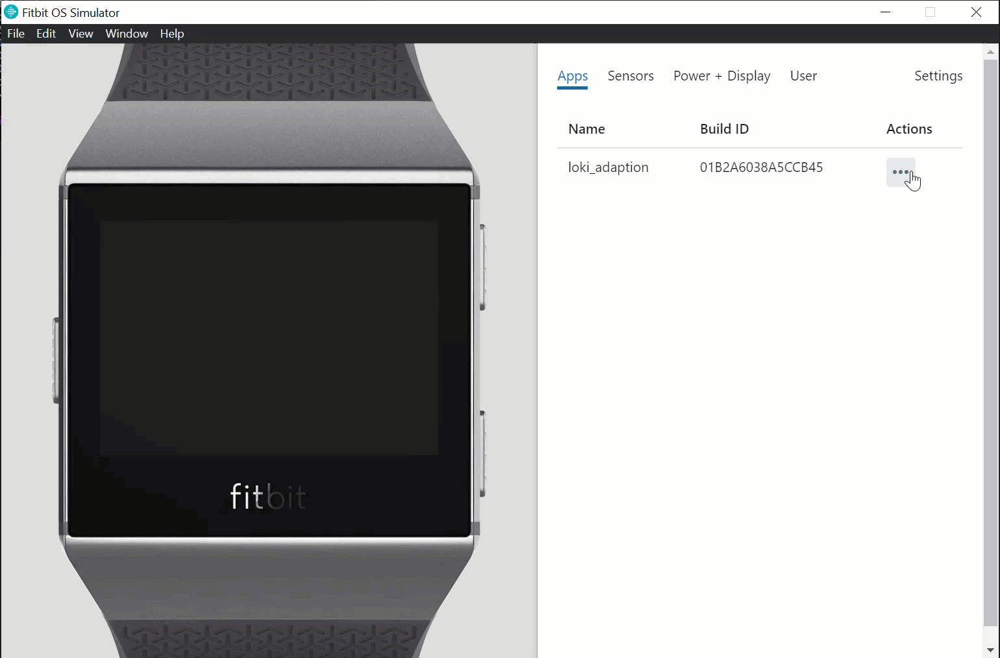

A fun custom Fitbit watch face I designed for my fiancé while we were dating. It has a simple watch face with a background image of our dog, Loki. If you click the sides of the screen in a pre-defined sequence, then a custom message would appear on the screen.

The code in this repo is quite old now and is no longer fully supported. I had to swap the sequence input to a `setTimeout` as the handlers I was using are no longer compatible.

